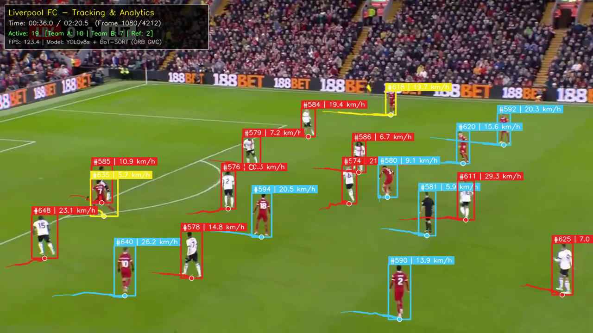
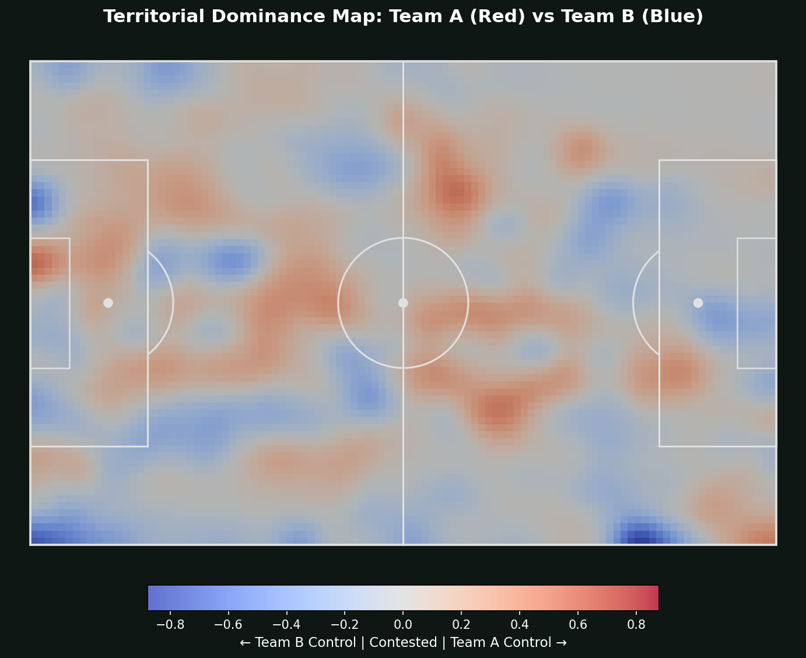
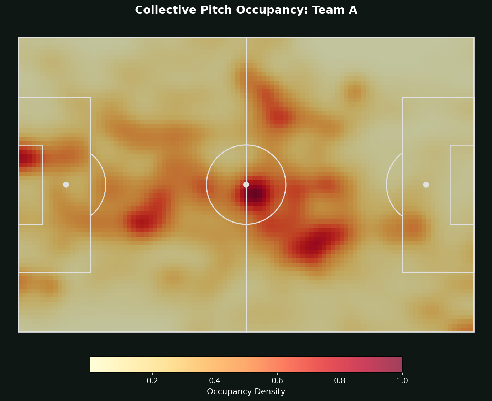

# ⚽ Football Player Tracking & Tactical Performance Analytics Pipeline

[](https://www.python.org/downloads/)
[](https://pytorch.org/)
[](https://github.com/ultralytics/ultralytics)
[-brightgreen.svg)](https://github.com/NirAharon/BoT-SORT)
[](https://www.soccer-net.org/)
[](LICENSE)

An end-to-end computer vision and sports analytics pipeline for **association football broadcast footage**, fine-tuned and validated on the official **SoccerNet Tracking-2023** benchmark. 

The pipeline bridges raw pixel detections with tactical football intelligence: multi-object tracking (MOT), global motion compensation (GMC), unsupervised team classification, camera-calibrated kinematics, collective team shapes, and pitch occupancy heatmaps.

---

## 📸 Visual Showcase

<div align="center">
  
  <p><em>Figure 1: Clean broadcast view with team-colored bounding boxes (Red: Liverpool, Sky-Blue: Opposition, Yellow: Ref/GK), smooth motion trails, real-time speed badges, and live match HUD.</em></p>
</div>

---

## 🏗️ System Architecture

```
                                  BROADCAST MATCH VIDEO
                                     (1080p / 720p)
                                            │
                                            ▼
                           ┌─────────────────────────────────┐
                           │   1. DETECTION MODULE (YOLOv8s) │
                           │   • 20 Epochs on SoccerNet-2023 │
                           │   • imgsz=640 | conf=0.35       │
                           │   • DetA: 70.49 | MOTA: 86.83   │
                           └────────────────┬────────────────┘
                                            │ Detections [x1, y1, x2, y2, conf]
                                            ▼
                           ┌─────────────────────────────────┐
                           │   2. TRACKING & GMC (BoT-SORT)  │
                           │   • ORB Global Motion Comp.     │
                           │   • Kalman State Estimation     │
                           │   • match_thresh=0.85, buffer=30│
                           │   • HOTA: 60.62 | IDF1: 70.62   │
                           └────────────────┬────────────────┘
                                            │ Persistent Tracklets
                                            ▼
             ┌──────────────────────────────┴──────────────────────────────┐
             │                                                             │
             ▼                                                             ▼
┌─────────────────────────────┐                               ┌─────────────────────────────┐
│ 3. PITCH MAPPING & GMC      │                               │ 4. TEAM CLASSIFICATION      │
│ • Dynamic Homography Matrix │                               │ • Torso Jersey Patch Crop   │
│   H_t = H_ref · M_{t->ref}  │                               │ • HSV Pitch Grass Masking   │
│ • Metric Pitch: 105m × 68m  │                               │ • CIELAB Color Clustering   │
│ • Camera Pan Subtraction    │                               │ • Temporal Majority Voting  │
│   (Prevents Speed Bleed)    │                               │ • 85.7% Acc on SNMOT-113    │
└────────────┬────────────────┘                               └──────────────┬──────────────┘
             │ Metric (X, Y) Coordinates                                     │ Team IDs [0, 1, 2]
             └──────────────────────────────┬────────────────────────────────┘
                                            │
                                            ▼
                           ┌─────────────────────────────────┐
                           │ 5. FOOTBALL TACTICAL ANALYTICS  │
                           ├─────────────────────────────────┤
                           │ • Kinematics: Distance, Speed   │
                           │   (km/h), Sprint Intensity Zones│
                           │ • Team Shape: Centroid, Width,  │
                           │   Length, Convex Hull (m^2)     │
                           │ • Formation Estimation (4-3-3)  │
                           │ • 2D Gaussian Pitch Heatmaps    │
                           └────────────────┬────────────────┘
                                            │
                                            ▼
                         ACTIONABLE DELIVERABLES & REPORTS
       ┌────────────────────────────┼────────────────────────────┐
       ▼                            ▼                            ▼
Full Broadcast Video        Match Analytics JSON         Tactical Heatmaps
(Clean Overlay @ 120 FPS)   (Executive Summary)       (Occupancy & Dominance)
```

---

## 🌟 Core Innovations & Technical Highlights

### 1. ORB Global Motion Compensation (GMC) & True Velocity Calibration
In sports broadcasting, the camera constantly pans and tilts across the field. Standard planar homographies mistake camera panning motion ($8\text{--}15\text{ px/frame}$) for physical player movement, artificially inflating speeds to $40+\text{ km/h}$ even for players standing still.
- We integrate **ORB Global Motion Compensation (GMC)** to estimate the camera's inter-frame affine matrix $\mathbf{M}_{t \to \text{ref}}$ from pitch background features.
- Dynamic homography composition:
  $$\mathbf{H}_t = \mathbf{H}_{\text{ref}} \cdot \mathbf{M}_{t \to \text{ref}}$$
- Coupled with a centered 11-frame low-pass filter, this subtracts camera panning vectors, recovering true biological human movements ($2\text{--}7\text{ km/h}$ walking, $14\text{--}22\text{ km/h}$ running).

### 2. Unsupervised Team Classification & Temporal Majority Voting
- **Jersey Torso Extraction**: Crops player upper torso ($y \in [y_1 + 0.15h, y_1 + 0.50h]$, $x \in [x_1 + 0.18w, x_2 - 0.18w]$) to avoid pitch borders and shorts.
- **Grass Masking**: Inverts HSV green thresholding ($H \in [30, 88]$) to exclude background pitch bleed around arms.
- **CIELAB Clustering**: Perceptually uniform color clustering separating Team A, Team B, and Referees/Goalkeepers.
- **Identity Locking**: Applies temporal majority voting per `track_id` across the video, preventing single-frame lighting flicker.
- **Benchmark**: Achieved **85.71% accuracy** against official ground-truth team labels on SoccerNet `SNMOT-113`.

### 3. Spatial Pitch Occupancy & Territorial Dominance Maps
Discretizes the standard FIFA $105\text{m} \times 68\text{m}$ pitch into $1\text{m}^2$ bins and evaluates 2D Gaussian Kernel Density Estimation (KDE):
- **Team Presence**: Independent spatial control density for each team.
- **Dominance Map**: Evaluates the differential control $\Delta(x, y) = \text{Norm}(\text{Density}_A) - \text{Norm}(\text{Density}_B)$, exposing dominant attacking channels vs. contested zones.

<div align="center">
  <table width="100%">
    <tr>
      <td width="50%" align="center">
        
        <br/><b>Territorial Dominance Map</b> (Red: Team A | Blue: Team B)
      </td>
      <td width="50%" align="center">
        
        <br/><b>Team A Collective Pitch Occupancy</b>
      </td>
    </tr>
  </table>
</div>

---

## 📊 Benchmark Results (SoccerNet Tracking-2023)

### Official Champion Benchmark (`experiments/final/botsort_champion.yaml`)
Evaluated across all **12 validation sequences (9,000 frames)** containing 148,000+ annotations:

| Metric | Score | Industry Interpretation |
| :--- | :---: | :--- |
| **HOTA** | **60.618** | Higher Order Tracking Accuracy ($\approx \sqrt{\text{DetA} \times \text{AssA}}$) |
| **DetA** | **70.489** | Detection Accuracy (high precision bounding box overlap) |
| **AssA** | **52.204** | Association Accuracy (temporal consistency across occlusions) |
| **IDF1** | **70.615** | Global Identity F1 score (**Peak across all evaluated configurations**) |
| **MOTA** | **86.829** | Multi-Object Tracking Accuracy (**Peak across all configurations**) |
| **IDSW** | **693** | Total Identity Switches (**-252 ID switches vs. baseline**) |
| **CLR_Pr** | **96.81%** | Precision on detected players |
| **CLR_Re** | **90.23%** | Recall on visible players |

### Systematic Parameter Progression (18 Evaluated Runs)

| Experiment | Configuration Detail | HOTA | AssA | IDF1 | IDSW | DetA | MOTA |
| :--- | :--- | :---: | :---: | :---: | :---: | :---: | :---: |
| **Baseline** | `conf=0.20`, `sparseOptFlow`, `match=0.80` | 59.863 | 50.978 | 68.228 | 945 | 70.429 | 86.547 |
| **Buffer Sweep** | `track_buffer = 15` | 59.765 | 50.864 | 68.199 | 930 | 70.356 | 86.459 |
| **Buffer Sweep** | `track_buffer = 60` | 59.816 | 50.958 | 68.258 | 975 | 70.346 | 86.566 |
| **Conf Sweep** | `conf = 0.15` | 59.763 | 50.890 | 68.038 | 936 | 70.316 | 86.366 |
| **Conf Sweep** | `conf = 0.35` | 60.368 | 51.753 | 69.569 | 728 | 70.529 | 86.801 |
| **GMC: None** | No camera compensation | 57.120 | 47.112 | 64.275 | 1099 | 69.432 | 85.382 |
| **GMC: ECC** | Enhanced Correlation Coefficient | 58.769 | 49.245 | 66.854 | 978 | 70.278 | 86.344 |
| **GMC: ORB** | ORB Feature Homography | 60.109 | 51.387 | 69.185 | 889 | 70.425 | 86.490 |
| **Alternative** | `conf=0.35`, `ORB GMC`, `match=0.80` | **60.652** | **52.230** | 70.289 | 720 | **70.532** | 86.799 |
| **Champion** | `conf=0.35`, `ORB GMC`, `match=0.85` | **60.618** | **52.204** | **70.615** | **693** | 70.489 | **86.829** |
| **With ReID** | `conf=0.35`, `ORB GMC`, `with_reid=True` | 59.402 | 50.173 | 68.911 | 815 | 70.440 | 86.683 |

> [!NOTE]
> **Why ReID degrades performance**: In football, teammates wear identical kits. Appearance embeddings map teammates to near-zero cosine distances, which actively triggers identity switches during scrums. Pure spatial-motion matching with ORB GMC achieves superior association.

---

## 🎯 Velocity Calibration: Before vs. After GMC

Demonstrating the necessity of Global Motion Compensation when extracting physical kinematics from broadcast footage (Penalty Box Sequence, Frame 1080):

| Track ID | Player Role / Observed Action | Raw Speed (Static) | Compensated Speed (ORB GMC) | Physiological Status |
| :---: | :--- | :---: | :---: | :--- |
| **#581** | Referee (Walking slowly) | <del>39.5 km/h</del> | **5.9 km/h** | Natural walking pace |
| **#586** | Outfield Defender (Strolling in box) | <del>38.9 km/h</del> | **6.7 km/h** | Natural walking pace |
| **#579** | Midfielder (Jogging forward) | <del>27.2 km/h</del> | **7.2 km/h** | Repositioning jog |
| **#585** | Defender (Shifting laterally) | <del>22.7 km/h</del> | **10.9 km/h** | Controlled jog |
| **#635** | Goalkeeper (Shuffling on goal line) | <del>11.7 km/h</del> | **5.7 km/h** | Keeper footwork |
| **#625** | Attacker (Tracking back) | <del>38.0 km/h</del> | **7.0 km/h** | Recovery jog |

---

## 📁 Repository Structure

```
football-player-tracking/
│
├── assets/                     # Visual showcase images & figures
│   ├── tracking_box_demo.png
│   ├── tracking_match_demo.png
│   ├── dominance_map.png
│   ├── team_a_heatmap.png
│   └── team_b_heatmap.png
│
├── data/
│   ├── raw/                    # SoccerNet tracking-2023 dataset
│   ├── processed/              # Formatted YOLO training splits
│   └── videos/                 # Evaluation match MP4s
│
├── models/                     # Fine-tuned YOLOv8 model weights
│
├── src/
│   ├── analytics/              # Phase 2 Football Intelligence
│   │   ├── team_classifier.py      # Jersey CIELAB clustering & voting
│   │   ├── kinematics.py           # Metric distance, speed, intensity zones
│   │   ├── heatmaps.py             # 2D Gaussian KDE pitch maps
│   │   ├── team_shape.py           # Centroids, convex hulls, formations
│   │   ├── pitch_model.py          # FIFA 105m x 68m geometry
│   │   ├── dynamic_pitch_mapper.py # Dynamic homography with ORB GMC
│   │   ├── generate_dynamic_trajectories.py # Velocity calibration
│   │   └── run_analytics.py        # End-to-end analytics CLI
│   │
│   ├── tracking/               # Tracking runners & evaluators
│   │   ├── evaluate_video.py       # Single video evaluation
│   │   └── evaluate_all_videos.py  # Batch multi-video evaluator
│   │
│   ├── evaluation/             # Official benchmark harness
│   │   ├── run_trackeval.py        # TrackEval benchmark runner
│   │   ├── compare_experiments.py  # Multi-experiment delta comparator
│   │   └── summarize_results.py    # Metric summary generator
│   │
│   └── visualization/          # High-speed video rendering
│       ├── render_tracking.py      # Clean broadcast renderer (120+ FPS)
│       └── render_radar_view.py    # Dual-view tactical radar renderer
│
├── experiments/                # Reproducible YAML configurations
│   ├── baseline/
│   ├── botsort_orb/
│   └── final/                  # Champion configuration
│
├── tests/                      # Automated unit & integration tests
│   ├── test_analytics.py       # Kinematics, heatmaps, team shape tests
│   └── test_team_classifier.py # SoccerNet SNMOT-113 GT benchmark
│
├── requirements.txt            # Python dependencies
├── LICENSE                     # MIT License
└── README.md
```

---

## ⚡ Quick Start & Usage

### 1. Installation
```bash
git clone https://github.com/DA-Shaurya/football-player-tracking.git
cd football-player-tracking
python -m venv .venv
# Windows:
.venv\Scripts\activate
# Linux/macOS:
source .venv/bin/activate

pip install -r requirements.txt
```

### 2. Run Full Tactical Analytics Pipeline
Execute end-to-end tracking analytics on any match video in a single command:
```bash
python src/analytics/run_analytics.py \
  --video data/videos/liverpool_highlights.mp4 \
  --tracking outputs/tracking/liverpool_tracking_champion.csv \
  --name liverpool
```
This automatically produces:
- `outputs/analytics/liverpool_analytics_summary.json` (Structured executive report)
- `outputs/analytics/liverpool_player_kinematics.csv` (Distances, top speeds, sprint bouts)
- `outputs/analytics/liverpool_team_shapes.csv` (Frame-by-frame convex hull & centroids)
- `outputs/analytics/heatmaps/*.png` (Territorial dominance and team occupancy heatmaps)

### 3. Render Clean Broadcast Video with Team Colors & Speeds
Render full-screen 1080p tracking footage at **120+ FPS**:
```bash
python src/visualization/render_tracking.py \
  --video data/videos/liverpool_highlights.mp4 \
  --csv outputs/tracking/liverpool_tracking_compensated.csv \
  --output outputs/videos/liverpool_tracked_clean.mp4 \
  --title "Premier League: Liverpool FC Analytics"
```

### 4. Reproduce Benchmark Metrics
Run TrackEval across the SoccerNet validation set:
```bash
python src/evaluation/run_trackeval.py --experiment botsort_conf35_orb_match85
```

### 5. Run Automated Tests
```bash
python tests/test_analytics.py
python tests/test_team_classifier.py
```

---

## 📜 Citation & Acknowledgements

This project builds upon:
- **SoccerNet**: *A benchmark for action spotting, camera calibration, and multi-object tracking in association football* ([SoccerNet Tracking-2023](https://www.soccer-net.org/)).
- **BoT-SORT**: *Robust Associations Multi-Pedestrian Tracker* (Aharon et al., 2022).
- **YOLOv8**: *Ultralytics Real-Time Object Detection*.

---

## 📄 License

This repository is distributed under the [MIT License](LICENSE).
